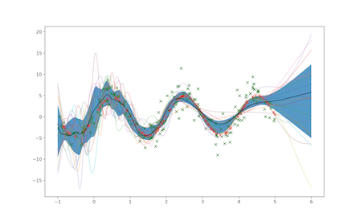

#autograd-mcmc

###A research library for gradient-based MCMC leveraging the HIPS Autograd library for Python.

##What is this?
This is a collection of short, general implementations for Markov Chain Monte Carlo algorithms, and examples of how to use them. Most of the algorithms use gradients, which can be automatically computed from [Autograd](https://github.com/HIPS/autograd)'s automatic differentiation. 

The algorithms can be used as templates for new MCMC algorithms or black-box(*ish*) MCMC tools. Any continuous-parameter model whose log-posterior is known up to a constant can be (in principle) be sampled by any of the algorithms in this library.

The algorithm implementations themselves strike a balance between idiomatic and optimized Python. In particular, this means heavily using numpy vectorization without overly complicating the implementation. Other optimizations (multiprocessing, etc.) can be added to suit specific use cases.

##Contents

``mcmc/``

``langevin.py`` implements

1. the traditional Langevin MCMC algorithm, 
2. the Metropolis-Adjusted Langevin Algorithm (MALA)
3. a 2nd order stochastic-Runge-Kutta solver for the Langevin diffusion.

``mh.py`` implements

1. the Random-Walk Metropolis-Hastings algorithm.

``hmc.py`` implements

1. the Hamiltonian Monte Carlo algorithm.

*\*NUTS is an obvious omission. Because of it's pathwise optimizations, NUTS is not simple or idiomatic to vectorize, so it has been omitted for now.*

``examples/``

1. ``one_d_test.py`` Sampling from a 1-dimensional multimodal distribution
2. ``two_d_tes.py`` Sampling from a 2-dimensional multimodal distribution. 
3. ``bayes_regression_mlp.py`` A 1-dimensional nonlinear regression problem using a MLP.\*\*
4. ``bayes_mnist_mlp.py`` MNIST classification using a Bayesian MLP.\*\*

*\*\*Based on the excellent Autograd [examples](https://github.com/HIPS/autograd/tree/master/examples).*



##Usage
If ``log_prob(x)`` is a function that uses Autograd and pure Python to return the (un-normalized) log-probability of the autograd.np array of samples ``x`` then, given an initial array of samples ``x0``, the Langevin algorithm is called as

```python
from mcmc import langevin
samples = langevin(log_prob, x0, num_iters = 1000, num_samples = 100,step_size = 0.001)
```

##Why?
- *Why write this library?* 
	1. Quickly benchmark new MCMC algorithms,
	2. Quickly test new (deep) Bayesian models. 
	3. Collect standard MCMC algorithm implementations in one place. 
- *Why HIPS-Autograd?*  
	1. Autograd-numpy has strong vectorization support.
	2. Autograd's elementwise-differentiation of vectorized functions makes gradient-based MCMC simple and fast. This is not supported by all AD libraries (e.g. Pytorch).
	3. Autograd's functional style is closer to true math than other many libraries. This make it intuitive for prototyping mathematical ideas at modest scales without learning large and complicated libraries/DSLs such as Tensorflow.

##Requirements
The only requirements for ``mcmc/`` are ``autograd`` and ``tqdm``.

The ``examples/`` require various standard ML libraries such as ``matplotlib`` (and ``tf.keras`` for preprocessing).